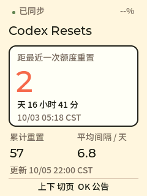
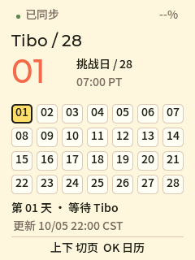

[English](README.md)

# AI Passport · Codex Resets

把 Codex 重置动态放进口袋里的 **FoloToy AI Passport**。项目包含原生固件和本地网页预览，将 [Codex Resets](https://codex-resets.com/zh-CN) 与 [Tibo 28 天挑战](https://codex-resets.com/zh-CN/tibo-28) 适配到 **240 × 320 屏幕和三个实体按键**。

| 重置追踪 | 28 天挑战 |
| --- | --- |
|  |  |

截图由实际 LVGL 界面在主机上渲染，使用固定样例数据；不是设备照片，也不是实时统计。

## 功能

- 显示距上次已执行重置的时间、累计重置次数、平均间隔和最新公告。
- 展示 28 天日历、每日结果和美西时间，处理夏令时。
- 设备每 5 分钟直接通过 HTTPS 更新；离线时保留上次成功获取的数据。
- 通过手机配网，设备无需账号、API Key、电脑中转或订阅。
- 网页预览支持真实公开数据、按键交互和离线模拟。

项目追踪公开公告，不显示个人账号额度，也不预测下一次重置。设备固定文案为简体中文，公告保留英文原文。本项目与 OpenAI、Codex Resets 网站无隶属关系。

## 体验网页预览

需要 Python 3.10 或以上，无需安装 Python 依赖。

```sh
git clone --branch feature/codex-resets https://github.com/onthebigtree/ai-passport-codex-resets.git
cd ai-passport-codex-resets
python3 preview/server.py --port 8765
```

打开 **http://127.0.0.1:8765**，使用网页按键或方向键和 Enter 操作。服务仅监听本机。预览是浏览器重绘，不是固件模拟器；设备运行不依赖它。

## 设备操作

| 按键 | 功能 |
| --- | --- |
| 上 / 下 | 切换两个主页面 |
| 追踪页按 OK | 查看最新公告；上 / 下滚动，OK 返回 |
| 挑战页按 OK | 进入日期选择；上 / 下选择，OK 返回 |
| 长按 OK | 手动刷新，最多每 15 秒一次 |
| 长按上键 | 打开或关闭 Wi-Fi 设置 |

首次启动时，用手机连接屏幕显示的热点，密码也在屏幕上。打开 **http://192.168.4.1**，输入 **2.4 GHz** Wi-Fi。设备获取 IP 后才把凭据保存在设备 NVS。连接成功或 10 分钟后关闭配网热点，可长按上键重开。

## 构建固件

目标硬件为 **ESP32-C3、8 MB Flash、无 PSRAM**，工具链为 **ESP-IDF 5.5.3**。按[环境搭建说明](docs/development/engineering/environment-setup.zh_CN.md)激活 ESP-IDF 后运行：

```sh
./tools/validate.sh
```

完整门禁包含仓库检查、主机测试、24 KiB 内存池下的实际 LVGL 渲染、固件构建及合并镜像校验。生成后的字体已入库，只有重新生成字体才需要 Node.js。CI 在应用分支 `feature/codex-resets` 上运行主机与固件检查，该分支也是仓库默认分支。

输出为 **`build/FoloToy-AI-Passport-full.bin`**，它是从 **`0x0`** 烧录的合并镜像。`build/firmware/` 下按哈希归档的目录保留匹配的 ELF、MAP 和清单。确认串口后，可在已激活的工具链中执行完整刷新：

```sh
python -m esptool --chip esp32c3 --port YOUR_SERIAL_PORT --baud 460800 write_flash 0x0 build/FoloToy-AI-Passport-full.bin
```

烧录合并镜像可能重置 Wi-Fi 设置和缓存。若需要保留设置，请按[分组件烧录规则](docs/development/engineering/firmware-layout.zh_CN.md)操作。Git 中不包含固件二进制、本地构建日志或凭据。

## 验证结果与限制

2026-10-05 的本地构建和主机测试均通过。对应固件已完成烧录并通过写入哈希校验，启动日志正常；设备使用者确认配网、两个数据页面、中文显示和按键正常。详见[验收记录与固件身份](docs/apps/codex-resets.zh_CN.md#真机验收)。

断电保存、断网恢复、长时间运行和续航仍未验证。挑战页暂无文档化公开 API，使用有大小限制的 HTML 适配器；原站结构变化可能需要更新。动态公告中的非 ASCII 字符替换为 `?`。设备默认未开启 NVS 加密和安全启动。

## 项目结构与致谢

| 路径 | 内容 |
| --- | --- |
| `main/reset_*.c` | 应用界面、日期与导航模型、数据解析和 Wi-Fi |
| `components/bsp/` | 上游板级支持 |
| `preview/` | 本地预览和只读数据代理 |
| `tests/` | 主机测试、样例和原生 LVGL 渲染 |
| [应用说明](docs/apps/codex-resets.zh_CN.md) | 数据规则、操作、构建和验收细节 |

基于 [FoloToy/ai-passport](https://github.com/FoloToy/ai-passport) 开发，保留上游历史和 [MIT 许可证](LICENSE)。Noto Sans SC 按 [SIL OFL 1.1](assets/fonts/OFL.txt) 分发，详见[字体来源](assets/README.zh_CN.md)。公开数据来自 [Codex Resets](https://codex-resets.com/zh-CN)。
